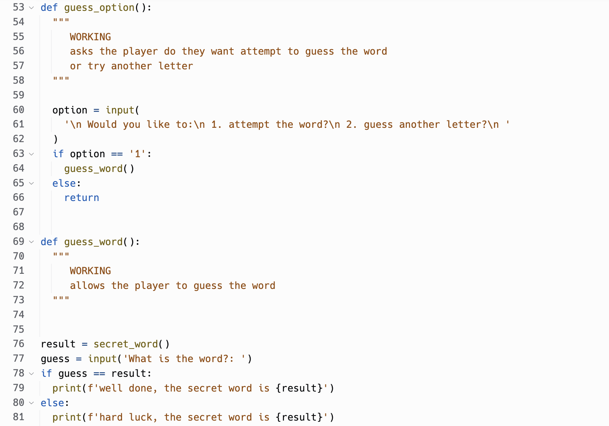
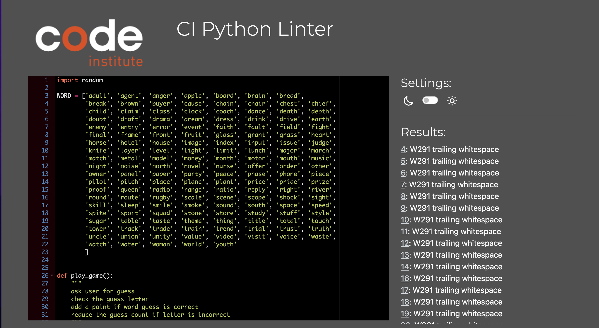
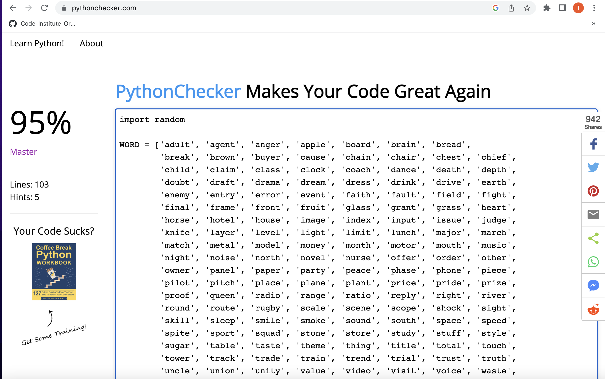
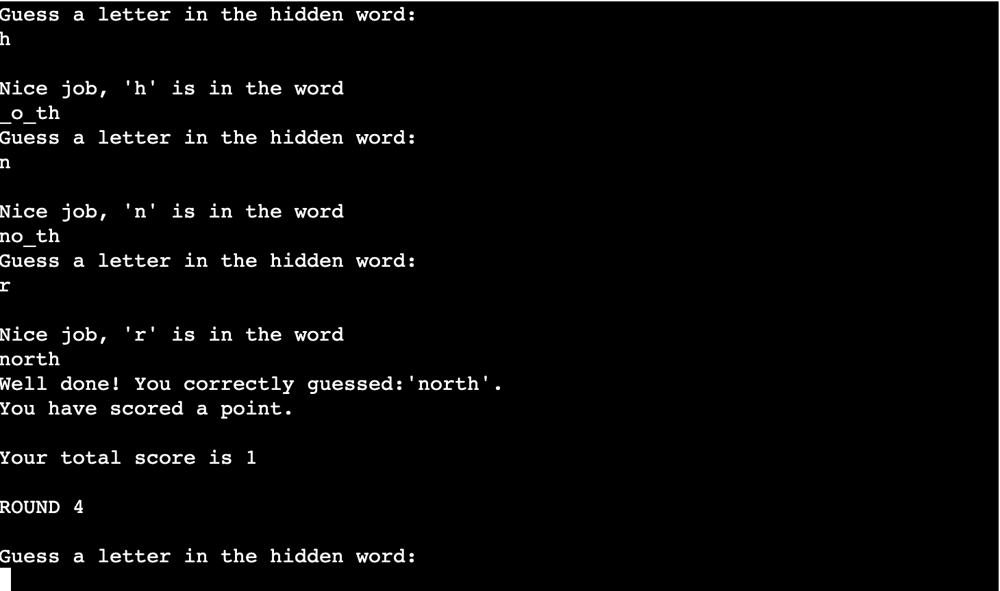
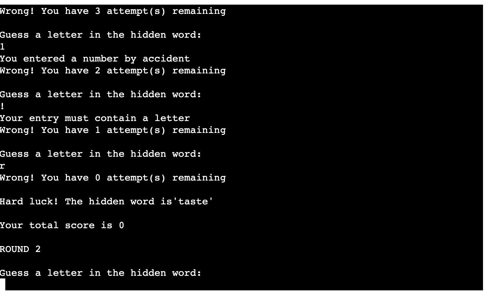

# 5-5-5 Word Game

5-5-5 is a game run through a Python terminal through the Heroku app.

The user has to guess five five-letter words chosen at random across five rounds by guessing the letters in the word in order to gain a clue. The user has five attempts/lifelines to help guess the word with each wrong guess eliminating one of these lifelines. 

Five Words. Five Letters. Five Lives. 5-5-5.

If the user guesses the word correctly they gain a point and move on to the next round. If they fail to guess the word and use all their lifelines they gain no points and proceed to the next round. The 'hidden' word is revealed at the end of each round and the users total score is tallied at the end of the game.

Live game: https://game-555.herokuapp.com/

## 1. How to Play:

Each round begins with the user being asked to guess a letter to see if it is within that word.

The guess is then validated to make sure it can be accepted by the game, so there are no special characters, numbers or spaces interfering with the attempt.

If the letter is in the word, its placement within the word is displayed in the terminal so the user begins to see what the word could possibly be. Any remaining letters are represented with a '_' to give a sense of what the user should guess next.

If the letter is not in the word, the user loses one of their five lifelines for the round and the words remains blank until a correct guess is submitted.

The round continues until the user has successfully guessed the word and gains a point or has exhausted all their lifelines and the user then proceeds to the next round until all five rounds have been played then the game ends and the players total score is displayed.

## 2. Features

  - Each word is generated at random from a global variable list. The large number of words ensures that the chance of encountering the same word twice in the game is very low.

  - Correctly guessed letters are displayed in the terminal and in the position they occur in the word so the user can start figuring out what the word might be.

  - Collects score throughout the rounds and gives the total at the end.

__Input validation:__

The validation ensures that the user cannot guess:

  - A number

  - A blank space

  - A non-alphabet character (!@£$% etc)

  - The same letter twice. If there is more than one instance of a guessed letter in the word all instances are displayed at once.

## 3. Future Features

I initially had a plan to introduce a feature that would allow the user takes a chance to guess the word earlier in the game and gain two points instead of one.

This would mean that after guessing a letter the user would have an option to 
1. Guess the word early or
2. Guess another letter to gain more clues.

This would have involved another level of validation to make sure that the users guess wasn't more or less than five letters as all hidden words only contain five letters.

On the advice of my mentor I removed it from the game to keep the code as simple as possible given the time restrictions and make sure I got the basics of the game working.

I had coded this in an earlier version of my project which is shown below. 

## 4. Testing 

I manually tested the code using the following tools:

The Code Institute Linter - no syntax errors returned but it made a commnent about trailing whitespace. I tried to correct this but I was limited by the line length and then I had to allow for the indentation of the square brackets. I tried to use a backslash but was told they had no effect within brackets.

PythonChecker.com - no major errors returned

I tested the code myself in my local terminals in Gitpod and Heroku and I also used Replit for initial writing of my code and tested it there too. The code performed as expected with no errors generated from the code.

### 4.1 Bugs

- One of the major bugs that had to be addressed was the user potentially entering the same letter twice. My mentor helped me with the code on how to manage this problem by sending the randomly selected word into a separate dictionary containing the individual letters that would be removed from the dictionary if the user guessed them and alerted them if they guessed it again.

- There were some minor issues such as objects appearing outside loops as well as indentation errors when copying text from my initial code in Replit and other testing tools into Gitpod but I cleared them up by going through the code line by line. 

- There were also some mismatched names/objects through combing my existing code with the code my mentor helped me with so I had to review all variable names to make sure they were interacting with each other correctly. 

- The only other minor change was that 'Round 1' was displaying as 'Round 0' due to the structure of the loop that ran the game but that was easily fixed.

### Other bugs: 

- There is an issue with how input handles blanks if a letter is in the input with a blank. I tried various ways of handling this but I kept getting the same result print statement of 'Your entry must contain a letter'. I will continue to try and solve it at a later date.

## 5. Deployment

The project is deployed using Code Institute's Mock Terminal in Heroku.

Steps taken:
- Fork/clone the repository
- Created a new Heroku app
- Set the build backs to Python and NodeJS
- Link the Heroku app to the repository
- Clicked Deploy

## 6. Credits 

- https://7esl.com/5-letter-words/ for the list of words
- https://www.youtube.com/watch?v=JNXmCOumNw0 for the code I edited to create the display letter and blank letter when the user submitted their guess.
- My mentor Rohit Sharma also helped me write additional code and cleaned up my earlier attempt. https://replit.com/@ThomasBerrigan/MentorCode
- My original code is listed here in Replit and the code that Rohit edited is listed here for comparison. https://replit.com/@ThomasBerrigan/Simple#main.py

## 7. Acknowledgements

- I would like to thank my Code Institute mentor Rohit Sharma for all of his help throughout the project.

